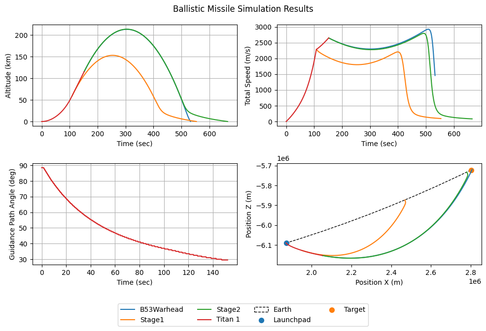
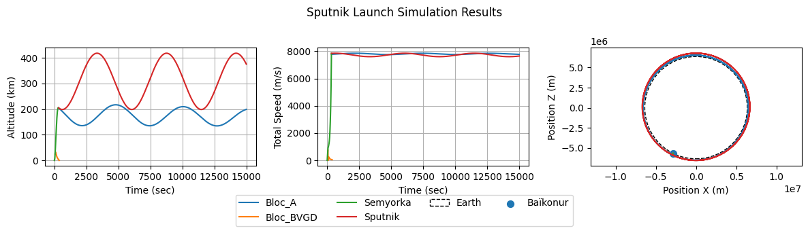

# MAD — Missile and Ballistic Simulation Library

MAD is a Python 3.12+ library for simulating 3-D ballistic and guided-missile trajectories in a planetary environment. It is designed around composable abstractions: physics objects, guidance laws, and a simulation orchestrator are kept strictly separate, making it easy to mix and match components.

It is a simplified simulation designed to easily reproduce rocket launches, cruise missiles, satellites orbiting earth, etc... like a simulation of ICBM strike:



Or the reproduction of the first Sputnik launch:



See a [full serie of notebooks](notebooks) showing how to use it.
Work In Progress!

---

## Table of contents

1. [Concepts](#concepts)
2. [Installation](#installation)
3. [Quick start](#quick-start)
4. [Project structure](#project-structure)
5. [Running tests and linting](#running-tests-and-linting)

---

## Concepts

### Simulation objects

The runtime model is centered on a single `Body` abstraction. `MovableObj` handles geometric state (position, velocity, active flag), `BallisticObj` adds physics-like mass/drag properties, and `Body` is the canonical simulation object used by the loop. Guidance and propulsion are attached as runtime components rather than encoded in a deep inheritance tree.

The simulation loop calls `update(dt, command)` to advance internal state and optionally spawn child bodies, then `integrate(dt, planet)` to step position and velocity forward using **Velocity Verlet** integration.

→ See [mad/objs/OBJECTS.MD](mad/objs/OBJECTS.MD) for the current runtime model, lifecycle, and object-authoring guide.

### Guidance

Guidance logic is kept separate from the body itself. A `Body` may receive a `guidance` object or strategy, whose output is stored in `guidance_results` and used to shape thrust direction or manoeuvre behaviour during the step.

Mission logic is built by composing guidance modules or managers; the body remains the state carrier while guidance handles intent and steering. This keeps the architecture simple while still supporting multi-phase or interrupt-driven behaviours.

→ See [mad/guidances/GUIDANCES.MD](mad/guidances/GUIDANCES.MD) for the guidance API and implementation guide.

### Configuration presets

Physical parameters for planets, projectiles, rockets, missiles, radars, and other entities live in `mad/configs/` as Python configuration data and dataclass-backed factories. These are kept separate from the runtime object logic so the flight model remains composable and the preset values stay easy to inspect, serialize, and extend.

→ See [mad/configs/CONFIGS.MD](mad/configs/CONFIGS.MD) for the layout of each config module and the defaults used by the simulation.

### Physics conventions

| Quantity | Unit |
|---|---|
| Distance | metres (m) |
| Velocity | m·s⁻¹ |
| Time | seconds (s) |
| Mass | kg |

Positions are 3-D ECEF-like NumPy vectors. Use `mad.utils.to_vec3` to normalise inputs. Gravity and atmospheric drag are provided by `Planet` objects (`mad/objs/planets.py`).

---

## Installation

The project uses [uv](https://github.com/astral-sh/uv) and is installed in editable mode.

```bash
# Install all dependencies (including dev extras)
uv sync --all-groups
```

Alternatively, the repository ships a `Dockerfile` / `docker-compose.yml` for a fully reproducible environment:

```bash
docker compose up
```

The Docker image also starts JupyterLab, giving instant access to the exploration notebooks in `notebooks/`.

---

## Quick start

```python
import numpy as np
from mad.objs.planets import Planet, PlanetConfig
from mad.objs.projectiles import Projectile, ProjectileConfig
from mad.configs.planets_cfg import EARTH_SETTINGS
from mad.simulation import run_simple_simulation

# Build the planet
earth = Planet(PlanetConfig(**{**EARTH_SETTINGS, "position": [0.0, 0.0, 0.0]}))

# Place a 1 kg rock at 500 km altitude, give it a horizontal kick
r0 = earth.radius + 500_000.0
cfg = ProjectileConfig(mass=1.0, ref_radius=0.05, Cd=0.47)
rock = cfg.create(
    position=[r0, 0.0, 0.0],
    velocity=[0.0, 7_600.0, 0.0],  # roughly circular-orbit speed
)

# Run for 1 hour, 1 s time step
objects = run_simple_simulation([rock], earth, dt=1.0, max_time=3600.0)
print(objects[0].position)
```

For guided-missile and multi-stage rocket examples, see the notebooks in `notebooks/`.

---

## Project structure

```
mad/
├── simulation.py          # Simulation orchestrator and run_simple_simulation helper
├── objs/                  # Simulation object classes
│   ├── OBJECTS.MD         # ← architecture docs
│   ├── base.py            # MovableObj, BallisticObj, Body and composition model
│   ├── projectiles.py
│   ├── rockets.py
│   ├── satellites.py
│   ├── cruise_missiles.py
│   ├── planets.py
│   ├── radars.py
│   ├── launchers.py
│   └── battle_computers.py
├── guidances/             # Guidance laws and strategy objects
│   ├── GUIDANCES.MD       # ← architecture docs
│   ├── base_guidances.py
│   ├── ICBM_guidances.py
│   ├── cruise_missiles_guidances.py
│   ├── satellite_guidances.py
│   └── interrupt_guidances.py
├── configs/               # Physical parameter presets and config factories
│   ├── CONFIGS.MD         # ← architecture docs
│   ├── physics_cfg.py     # constants & unit conversions
│   ├── planets_cfg.py
│   ├── projectiles_cfg.py
│   ├── ballistic_objects_cfg.py
│   ├── cruise_missiles_cfg.py
│   ├── satellites_cfg.py
│   ├── warheads_cfg.py
│   └── radars_cfg.py
├── utils/                 # Helper utilities
│   ├── base_utils.py      # to_vec3, extract_history, …
│   ├── ballistic_tables.py
│   ├── plotters.py
│   └── logger.py
└── scripts/               # CLI tools
    └── tabulate_ballistic_range.py

notebooks/                 # Interactive validation / exploration
tests/                     # Pytest suite
```

---

## Running tests and linting

```bash
# Run the test suite
pytest

# Lint (line-length 120)
ruff check mad/

# Formatting check
black --check mad/

# Type-check (notebooks excluded)
pyrefly check mad/
```

Apply auto-fixes:

```bash
ruff check --fix mad/
black mad/
```


### Recommended readings:

- **Ignition!** *An Informal History of Liquid Rocket Propellants* by John D. Clark
- **Failure is not an option** by Gene Kranz

- [Atomic Rockets](https://projectrho.com/public_html/rocket/)